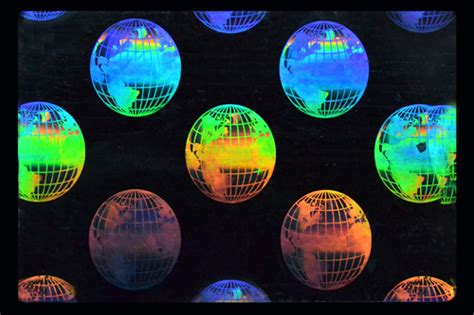

# IridescentView

[Ler em português](README.md)




The IridescentView is a custom ImageView that applies an iridescent effect on images, according to the device's rotation. The rotation is acquired by the accelerometer and used for the calculation of the effect.

The component is available for Android Java and Xamarin.Android.

## To use in Android Java

In the Gradle scripts,  the JCenter's Maven repository must be declared:

```kt
allprojects {
    repositories {
        google()
        jcenter()
        // other Maven repositories
    }
}
```

In the Gradle script of the module in which you want to use the View, include the dependency inside the `dependencies` block:

```kt
implementation("br.alexandrehtrb.iridescentview:iridescentview:1.0.0")
```

To use the View in a XML layout, add like below:

```xml
<br.alexandrehtrb.iridescentview.IridescentView
    android:id="@+id/iridescent_star"
    android:layout_height="wrap_content"
    android:layout_width="wrap_content"
    android:layout_centerInParent="true"
    android:src="@drawable/black_star"/>
 ```

The minimum Android API is API 11 (Android 3.0 Honeycomb).

## To use in Xamarin.Android

To add the component in yout project, install the [NuGet package](https://www.nuget.org/packages/Br.AlexandreHtrb.IridescentView/):

```
Install-Package Br.AlexandreHtrb.IridescentView -Version 1.0.0
```

To use the View in a AXML layout, add like below:

```xml
<!-- The complete name of the class is different in Xamarin.Android -->
<Br.AlexandreHtrb.IridescentView.IridescentView
    android:id="@+id/iridescent_star"
    android:layout_height="wrap_content"
    android:layout_width="wrap_content"
    android:layout_centerInParent="true"
    android:src="@drawable/black_star"/>
```

The minimum Android API is API 28 (Android 9.0 Pie).